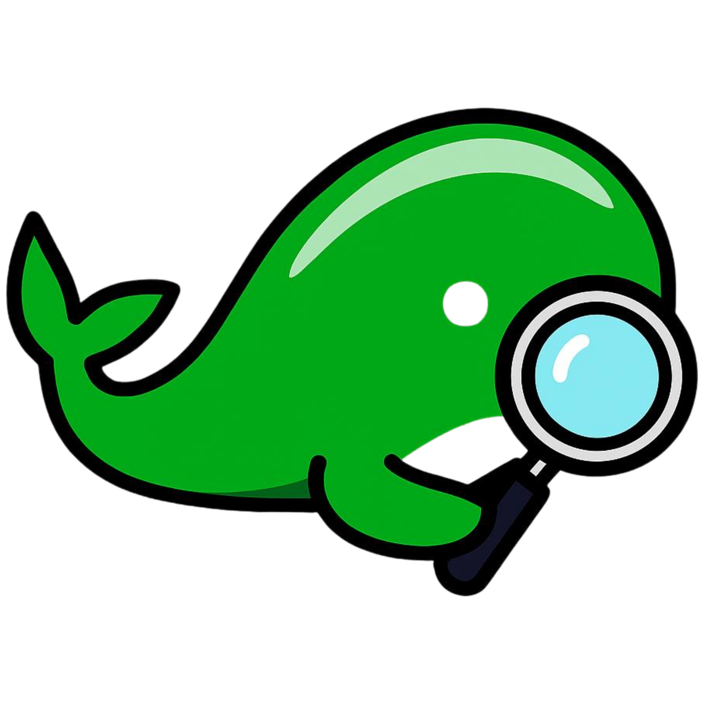

<div id="top">

<!-- HEADER STYLE: CLASSIC -->
<div align="center">



# DOCKENV

<em></em>

<!-- BADGES -->


<!-- default option, no dependency badges. -->

<!-- default option, no dependency badges. -->

</div>
<br>

---

## Table of Contents

- [Table of Contents](#table-of-contents)
- [Overview](#overview)
- [Features](#features)
- [Project Structure](#project-structure)
  - [Project Index](#project-index)
- [Getting Started](#getting-started)
  - [Prerequisites](#prerequisites)
  - [Installation](#installation)
  - [Usage](#usage)
  - [Testing](#testing)
- [Roadmap](#roadmap)
- [Contributing](#contributing)
- [License](#license)
- [Acknowledgments](#acknowledgments)

---

## Overview

---

## Features

<code>❯ REPLACE-ME</code>

---

## Project Structure

```sh
└── dockenv/
    ├── cmd
    │   ├── root.go
    │   └── scan.go
    ├── docker-test
    │   └── Dockerfile
    ├── go.mod
    ├── go.sum
    ├── internal
    │   ├── analyzer
    │   ├── docker
    │   ├── output
    │   └── scanner
    ├── main.go
    └── pkg
        └── model
```

### Project Index

<details open>
	<summary><b><code>DOCKENV/</code></b></summary>
	<!-- __root__ Submodule -->
	<details>
		<summary><b>__root__</b></summary>
		<blockquote>
			<div class='directory-path' style='padding: 8px 0; color: #666;'>
				<code><b>⦿ __root__</b></code>
			<table style='width: 100%; border-collapse: collapse;'>
			<thead>
				<tr style='background-color: #f8f9fa;'>
					<th style='width: 30%; text-align: left; padding: 8px;'>File Name</th>
					<th style='text-align: left; padding: 8px;'>Summary</th>
				</tr>
			</thead>
				<tr style='border-bottom: 1px solid #eee;'>
					<td style='padding: 8px;'><b><a href='https://github.com/arasdenizhan/dockenv/blob/master/go.sum'>go.sum</a></b></td>
					<td style='padding: 8px;'>Code>❯ REPLACE-ME</code></td>
				</tr>
				<tr style='border-bottom: 1px solid #eee;'>
					<td style='padding: 8px;'><b><a href='https://github.com/arasdenizhan/dockenv/blob/master/main.go'>main.go</a></b></td>
					<td style='padding: 8px;'>Code>❯ REPLACE-ME</code></td>
				</tr>
				<tr style='border-bottom: 1px solid #eee;'>
					<td style='padding: 8px;'><b><a href='https://github.com/arasdenizhan/dockenv/blob/master/go.mod'>go.mod</a></b></td>
					<td style='padding: 8px;'>Code>❯ REPLACE-ME</code></td>
				</tr>
			</table>
		</blockquote>
	</details>
	<!-- pkg Submodule -->
	<details>
		<summary><b>pkg</b></summary>
		<blockquote>
			<div class='directory-path' style='padding: 8px 0; color: #666;'>
				<code><b>⦿ pkg</b></code>
			<!-- model Submodule -->
			<details>
				<summary><b>model</b></summary>
				<blockquote>
					<div class='directory-path' style='padding: 8px 0; color: #666;'>
						<code><b>⦿ pkg.model</b></code>
					<table style='width: 100%; border-collapse: collapse;'>
					<thead>
						<tr style='background-color: #f8f9fa;'>
							<th style='width: 30%; text-align: left; padding: 8px;'>File Name</th>
							<th style='text-align: left; padding: 8px;'>Summary</th>
						</tr>
					</thead>
						<tr style='border-bottom: 1px solid #eee;'>
							<td style='padding: 8px;'><b><a href='https://github.com/arasdenizhan/dockenv/blob/master/pkg/model/finding.go'>finding.go</a></b></td>
							<td style='padding: 8px;'>Code>❯ REPLACE-ME</code></td>
						</tr>
					</table>
				</blockquote>
			</details>
		</blockquote>
	</details>
	<!-- internal Submodule -->
	<details>
		<summary><b>internal</b></summary>
		<blockquote>
			<div class='directory-path' style='padding: 8px 0; color: #666;'>
				<code><b>⦿ internal</b></code>
			<!-- scanner Submodule -->
			<details>
				<summary><b>scanner</b></summary>
				<blockquote>
					<div class='directory-path' style='padding: 8px 0; color: #666;'>
						<code><b>⦿ internal.scanner</b></code>
					<table style='width: 100%; border-collapse: collapse;'>
					<thead>
						<tr style='background-color: #f8f9fa;'>
							<th style='width: 30%; text-align: left; padding: 8px;'>File Name</th>
							<th style='text-align: left; padding: 8px;'>Summary</th>
						</tr>
					</thead>
						<tr style='border-bottom: 1px solid #eee;'>
							<td style='padding: 8px;'><b><a href='https://github.com/arasdenizhan/dockenv/blob/master/internal/scanner/scan.go'>scan.go</a></b></td>
							<td style='padding: 8px;'>Code>❯ REPLACE-ME</code></td>
						</tr>
					</table>
				</blockquote>
			</details>
			<!-- analyzer Submodule -->
			<details>
				<summary><b>analyzer</b></summary>
				<blockquote>
					<div class='directory-path' style='padding: 8px 0; color: #666;'>
						<code><b>⦿ internal.analyzer</b></code>
					<table style='width: 100%; border-collapse: collapse;'>
					<thead>
						<tr style='background-color: #f8f9fa;'>
							<th style='width: 30%; text-align: left; padding: 8px;'>File Name</th>
							<th style='text-align: left; padding: 8px;'>Summary</th>
						</tr>
					</thead>
						<tr style='border-bottom: 1px solid #eee;'>
							<td style='padding: 8px;'><b><a href='https://github.com/arasdenizhan/dockenv/blob/master/internal/analyzer/scorer.go'>scorer.go</a></b></td>
							<td style='padding: 8px;'>Code>❯ REPLACE-ME</code></td>
						</tr>
						<tr style='border-bottom: 1px solid #eee;'>
							<td style='padding: 8px;'><b><a href='https://github.com/arasdenizhan/dockenv/blob/master/internal/analyzer/rules.go'>rules.go</a></b></td>
							<td style='padding: 8px;'>Code>❯ REPLACE-ME</code></td>
						</tr>
					</table>
				</blockquote>
			</details>
			<!-- output Submodule -->
			<details>
				<summary><b>output</b></summary>
				<blockquote>
					<div class='directory-path' style='padding: 8px 0; color: #666;'>
						<code><b>⦿ internal.output</b></code>
					<table style='width: 100%; border-collapse: collapse;'>
					<thead>
						<tr style='background-color: #f8f9fa;'>
							<th style='width: 30%; text-align: left; padding: 8px;'>File Name</th>
							<th style='text-align: left; padding: 8px;'>Summary</th>
						</tr>
					</thead>
						<tr style='border-bottom: 1px solid #eee;'>
							<td style='padding: 8px;'><b><a href='https://github.com/arasdenizhan/dockenv/blob/master/internal/output/table.go'>table.go</a></b></td>
							<td style='padding: 8px;'>Code>❯ REPLACE-ME</code></td>
						</tr>
						<tr style='border-bottom: 1px solid #eee;'>
							<td style='padding: 8px;'><b><a href='https://github.com/arasdenizhan/dockenv/blob/master/internal/output/color.go'>color.go</a></b></td>
							<td style='padding: 8px;'>Code>❯ REPLACE-ME</code></td>
						</tr>
					</table>
				</blockquote>
			</details>
			<!-- docker Submodule -->
			<details>
				<summary><b>docker</b></summary>
				<blockquote>
					<div class='directory-path' style='padding: 8px 0; color: #666;'>
						<code><b>⦿ internal.docker</b></code>
					<table style='width: 100%; border-collapse: collapse;'>
					<thead>
						<tr style='background-color: #f8f9fa;'>
							<th style='width: 30%; text-align: left; padding: 8px;'>File Name</th>
							<th style='text-align: left; padding: 8px;'>Summary</th>
						</tr>
					</thead>
						<tr style='border-bottom: 1px solid #eee;'>
							<td style='padding: 8px;'><b><a href='https://github.com/arasdenizhan/dockenv/blob/master/internal/docker/image.go'>image.go</a></b></td>
							<td style='padding: 8px;'>Code>❯ REPLACE-ME</code></td>
						</tr>
						<tr style='border-bottom: 1px solid #eee;'>
							<td style='padding: 8px;'><b><a href='https://github.com/arasdenizhan/dockenv/blob/master/internal/docker/container.go'>container.go</a></b></td>
							<td style='padding: 8px;'>Code>❯ REPLACE-ME</code></td>
						</tr>
					</table>
				</blockquote>
			</details>
		</blockquote>
	</details>
	<!-- docker-test Submodule -->
	<details>
		<summary><b>docker-test</b></summary>
		<blockquote>
			<div class='directory-path' style='padding: 8px 0; color: #666;'>
				<code><b>⦿ docker-test</b></code>
			<table style='width: 100%; border-collapse: collapse;'>
			<thead>
				<tr style='background-color: #f8f9fa;'>
					<th style='width: 30%; text-align: left; padding: 8px;'>File Name</th>
					<th style='text-align: left; padding: 8px;'>Summary</th>
				</tr>
			</thead>
				<tr style='border-bottom: 1px solid #eee;'>
					<td style='padding: 8px;'><b><a href='https://github.com/arasdenizhan/dockenv/blob/master/docker-test/Dockerfile'>Dockerfile</a></b></td>
					<td style='padding: 8px;'>Code>❯ REPLACE-ME</code></td>
				</tr>
			</table>
		</blockquote>
	</details>
	<!-- cmd Submodule -->
	<details>
		<summary><b>cmd</b></summary>
		<blockquote>
			<div class='directory-path' style='padding: 8px 0; color: #666;'>
				<code><b>⦿ cmd</b></code>
			<table style='width: 100%; border-collapse: collapse;'>
			<thead>
				<tr style='background-color: #f8f9fa;'>
					<th style='width: 30%; text-align: left; padding: 8px;'>File Name</th>
					<th style='text-align: left; padding: 8px;'>Summary</th>
				</tr>
			</thead>
				<tr style='border-bottom: 1px solid #eee;'>
					<td style='padding: 8px;'><b><a href='https://github.com/arasdenizhan/dockenv/blob/master/cmd/root.go'>root.go</a></b></td>
					<td style='padding: 8px;'>Code>❯ REPLACE-ME</code></td>
				</tr>
				<tr style='border-bottom: 1px solid #eee;'>
					<td style='padding: 8px;'><b><a href='https://github.com/arasdenizhan/dockenv/blob/master/cmd/scan.go'>scan.go</a></b></td>
					<td style='padding: 8px;'>Code>❯ REPLACE-ME</code></td>
				</tr>
			</table>
		</blockquote>
	</details>
</details>

---

## Getting Started

### Prerequisites

This project requires the following dependencies:

- **Programming Language:** Go
- **Package Manager:** Go modules
- **Container Runtime:** Docker

### Installation

Build dockenv from the source and intsall dependencies:

1. **Clone the repository:**

   ```sh
   ❯ git clone https://github.com/arasdenizhan/dockenv
   ```

2. **Navigate to the project directory:**

   ```sh
   ❯ cd dockenv
   ```

3. **Install the dependencies:**

<!-- SHIELDS BADGE CURRENTLY DISABLED -->

    <!-- [![docker][docker-shield]][docker-link] -->
    <!-- REFERENCE LINKS -->
    <!-- [docker-shield]: https://img.shields.io/badge/Docker-2CA5E0.svg?style={badge_style}&logo=docker&logoColor=white -->
    <!-- [docker-link]: https://www.docker.com/ -->

    **Using [docker](https://www.docker.com/):**

    ```sh
    ❯ docker build -t arasdenizhan/dockenv .
    ```

<!-- SHIELDS BADGE CURRENTLY DISABLED -->

    <!-- [![go modules][go modules-shield]][go modules-link] -->
    <!-- REFERENCE LINKS -->
    <!-- [go modules-shield]: https://img.shields.io/badge/Go-00ADD8.svg?style={badge_style}&logo=go&logoColor=white -->
    <!-- [go modules-link]: https://golang.org/ -->

    **Using [go modules](https://golang.org/):**

    ```sh
    ❯ go build
    ```

### Usage

Run the project with:

**Using [docker](https://www.docker.com/):**

```sh
docker run -it {image_name}
```

**Using [go modules](https://golang.org/):**

```sh
go run {entrypoint}
```

### Testing

Dockenv uses the {**test_framework**} test framework. Run the test suite with:

**Using [go modules](https://golang.org/):**

```sh
go test ./...
```

---

## Roadmap

- [x] **`Task 1`**: <strike>Implement feature one.</strike>
- [ ] **`Task 2`**: Implement feature two.
- [ ] **`Task 3`**: Implement feature three.

---

## Contributing

- **💬 [Join the Discussions](https://github.com/arasdenizhan/dockenv/discussions)**: Share your insights, provide feedback, or ask questions.
- **🐛 [Report Issues](https://github.com/arasdenizhan/dockenv/issues)**: Submit bugs found or log feature requests for the `dockenv` project.
- **💡 [Submit Pull Requests](https://github.com/arasdenizhan/dockenv/blob/main/CONTRIBUTING.md)**: Review open PRs, and submit your own PRs.

<details closed>
<summary>Contributing Guidelines</summary>

1. **Fork the Repository**: Start by forking the project repository to your github account.
2. **Clone Locally**: Clone the forked repository to your local machine using a git client.
   ```sh
   git clone https://github.com/arasdenizhan/dockenv
   ```
3. **Create a New Branch**: Always work on a new branch, giving it a descriptive name.
   ```sh
   git checkout -b new-feature-x
   ```
4. **Make Your Changes**: Develop and test your changes locally.
5. **Commit Your Changes**: Commit with a clear message describing your updates.
   ```sh
   git commit -m 'Implemented new feature x.'
   ```
6. **Push to github**: Push the changes to your forked repository.
   ```sh
   git push origin new-feature-x
   ```
7. **Submit a Pull Request**: Create a PR against the original project repository. Clearly describe the changes and their motivations.
8. **Review**: Once your PR is reviewed and approved, it will be merged into the main branch. Congratulations on your contribution!
</details>

<details closed>
<summary>Contributor Graph</summary>
<br>
<p align="left">
   <a href="https://github.com{/arasdenizhan/dockenv/}graphs/contributors">
      
   </a>
</p>
</details>

---

## License

Dockenv is protected under the [LICENSE](https://choosealicense.com/licenses) License. For more details, refer to the [LICENSE](https://choosealicense.com/licenses/) file.

---

## Acknowledgments

- Credit `contributors`, `inspiration`, `references`, etc.

<div align="right">

[![][back-to-top]](#top)

</div>

[back-to-top]: https://img.shields.io/badge/-BACK_TO_TOP-151515?style=flat-square

---
